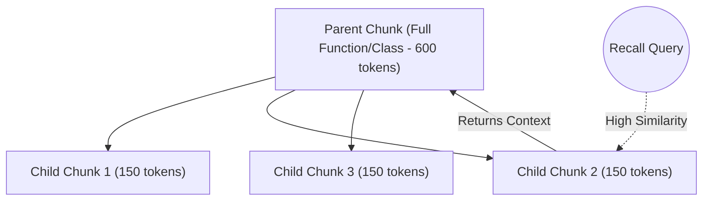

# Qilin: Proposed Features & Developer Improvements

This document outlines high-impact feature proposals designed to make Qilin an even more powerful, developer-friendly, and flexible tool for local AI code memory.

---

## 1. Multi-Provider Embedding Engine

### Concept
Currently, Qilin is hardwired to use **Ollama** and the `nomic-embed-text-v2-moe` model. While running a local model is great for privacy, it can be resource-heavy for developers working on laptops with limited GPU resources, or those who prefer cloud-hosted embedding options.

We propose introducing a pluggable embedding interface supporting external APIs (such as OpenAI, Google Gemini, Cohere, or local Hugging Face pipelines).

### Proposed Changes

* **Configuration Updates** (`src/qilin/config.py`):
  Add configuration keys:
  ```python
  embedding_provider: str = Field(default="ollama", description="ollama | openai | gemini | cohere | local")
  api_key: str | None = Field(default=None)
  api_base_url: str | None = Field(default=None)
  ```
* **Embedder Interface** (`src/qilin/embeddings.py`):
  Refactor `OllamaEmbedder` into a generic `BaseEmbedder` interface, introducing specialized implementations:
  * `OllamaEmbedder` (current setup)
  * `OpenAIEmbedder` (for `text-embedding-3-small` / `large`)
  * `GeminiEmbedder` (for `text-embedding-004`)
  * `HuggingFaceEmbedder` (via `sentence-transformers` for native Python execution without Ollama)

### Developer Value
* **Lighter footprint**: Run Qilin without Ollama consuming VRAM on the host machine.
* **Higher retrieval quality**: Seamlessly upgrade to state-of-the-art embedding models if needed.
* **Ease of deployment**: Simple config swap to transition between local-only and cloud-connected developer environments.

---

## 2. Git-Branch-Aware Collection Routing

### Concept
In a standard Git workflow, developers switch branches constantly. Codebases look very different on a feature branch compared to `main`. Currently, Qilin ingests everything into a shared repository collection, causing code from different branches to collide or become stale.

We propose making collections **Git branch-aware**, allowing isolated memory spaces that automatically sync and route query results based on the developer's active branch.

### Proposed Changes

* **Automatic Branch Isolation**:
  * The host CLI (`qilin ingest` or `qilin watch`) queries the current Git branch using `git rev-parse --abbrev-ref HEAD`.
  * If a branch option is enabled, it prefixes/suffixes the target collection name (e.g., `myrepo` -> `myrepo-feature-auth`).
* **Hierarchical Recall Routing**:
  * Modify `recall` and `recall_files` to accept a list of collections or fallbacks.
  * When querying `myrepo-feature-auth`, Qilin can automatically query *both* the feature branch collection and the baseline `main` collection, merging results but prioritising the active branch's chunks.
* **Git Hook Triggers**:
  * Provide a shell command/installer to configure a `post-checkout` or `post-commit` Git hook, automatically running incremental indexing.

### Developer Value
* **Accurate context**: The LLM won't retrieve code definitions that only exist on another feature branch.
* **No manual cleanups**: Removes the need to manually rebuild or purge collections when shifting tasks.

---

## 3. Parent-Child (Hierarchical) Chunking

### Concept
A common issue with vector search is the trade-off between **precision** and **context size**:
* Small chunks (e.g., 50-100 tokens) yield highly precise search results but lack context when sent to the LLM.
* Large chunks (e.g., 500-1000 tokens) retain context but dilute semantic similarity, meaning query relevance scores drop.

We propose **Parent-Child Chunking**: we store tiny "child" chunks for semantic matching, but associate them with larger "parent" codeblocks (like the entire function or class body) that are returned during recall.



### Proposed Changes

* **Payload Mapping** (`src/qilin/store.py`):
  * When storing, parent chunks (large tokens) are mapped to a set of child chunks (smaller tokens).
  * Child points are embedded and upserted. Their payload references their parent ID: `parent_id: <uuid>`.
* **Rerouted Retrieval** (`src/qilin/tools.py`):
  * The `recall` search runs on child vectors.
  * Before returning hits, Qilin retrieves the parent payload for each matching child ID, returning the complete parent text to the client.

### Developer Value
* **Maximum context quality**: The LLM gets the entire method or paragraph even if only a single line matched the query.
* **Higher recall accuracy**: Resolves cases where search results are cut off mid-declaration.

---

## 4. Local Developer UI & Test Bench

### Concept
Qdrant provides a default database dashboard at `http://localhost:6333/dashboard`, but it is generic and shows raw payloads/vectors. Developers using Qilin want to understand *how* their code is chunked, *what* chunks are matched for a query, and *why* specific files are prioritized.

We propose embedding a sleek, lightweight **Qilin Dev Dashboard** inside the Python MCP server.

```
+-----------------------------------------------------------+
| QILIN DEV DASHBOARD                              [Status] |
+-----------------------------------------------------------+
|  Collections  |  Test Bench  |  Feedback Log  |  Settings |
+-----------------------------------------------------------+
| Query: "How does authenticate_user handle tokens?"        |
| Mode: [Hybrid v]  Rerank: [Yes v]  Top-K: [5 ]   [Search] |
+-----------------------------------------------------------+
| Hits:                                                     |
| [1] auth.py:L40-80  (Score: 0.92)                 [Delete]|
|     "def authenticate_user(token):..."                    |
|                                                           |
| [2] jwt.py:L12-30   (Score: 0.81)                 [Delete]|
|     "class TokenHandler:..."                              |
+-----------------------------------------------------------+
```

### Proposed Changes

* **Dashboard Web App**:
  * Create a single-page app (React/Svelte or Tailwind-styled vanilla JS) served via a `/dashboard` HTTP endpoint.
  * FastMCP/FastAPI can serve this static directory when enabled.
* **Interactive Tooling**:
  * **Test Bench**: Input query strings, adjust parameters (`score_threshold`, `mmr_lambda`, `mode`), and inspect the returned source code blocks, similarity scores, and BM25 sparse weights side-by-side.
  * **Memory Curator**: View and delete specific file chunks or manually label memories.
  * **Visual Feedback Viewer**: Displays recall history and analytics (`~/.qilin/logs/recall.jsonl`) to track what queries the AI client is executing.

### Developer Value
* **Greatly improved visibility**: Devs can immediately debug why their IDE is or isn't seeing certain codebase memories.
* **Interactive tuning**: Instantly test search parameters without editing JSON configs.

---

## 5. IDE Integrations (VS Code & JetBrains Extensions)

### Concept
To use Qilin today, developers must run terminal commands (`qilin init`, `qilin up`, `qilin ingest`) and manually configure JSON settings inside Cursor or Claude Desktop. A native editor extension would streamline this.

### Proposed Changes

* **Visual Controls**:
  * Status-bar items showing server status (e.g., `Qilin: Active (12,430 vectors)`).
  * Right-click workspace folder -> "Index with Qilin".
* **Automated Daemon Management**:
  * The extension launches `qilin up` when the IDE opens, and can automatically execute `qilin watch` for the active workspace.
* **Search Side-Panel**:
  * A dedicated sidebar panel allowing devs to quickly search the vector store and copy relevant code snippets directly.

### Developer Value
* **Frictionless onboarding**: One-click setup without needing to interact with the command line.
* **Integrated workflow**: Syncing and tracking filesystem changes automatically inside the editor session.

---

## 6. Expanded Tree-Sitter Language Support

### Concept
The current code-aware chunker (`src/qilin/code_chunking.py`) supports Python, Go, JS, TS, TSX, and Rust. Developers coding in other widespread languages (e.g., C/C++, Java, Kotlin, C#) fall back to the prose chunker.

We propose expanding the tree-sitter definition configurations.

### Proposed Changes

* Extend `LANGUAGE_SPECS` in `src/qilin/code_chunking.py` to include:
  * **C/C++**:
    ```python
    "cpp": _LanguageSpec(
        definition_types=frozenset({"function_definition", "class_specifier", "struct_specifier"}),
        import_types=frozenset({"preproc_include"}),
    )
    ```
  * **Java**:
    ```python
    "java": _LanguageSpec(
        definition_types=frozenset({"class_declaration", "method_declaration", "interface_declaration"}),
        import_types=frozenset({"import_declaration"}),
    )
    ```
  * **C#**:
    ```python
    "csharp": _LanguageSpec(
        definition_types=frozenset({"class_declaration", "method_declaration", "interface_declaration", "struct_declaration"}),
        import_types=frozenset({"using_directive"}),
    )
    ```

### Developer Value
* **Language inclusivity**: Opens up semantic code search benefits to mobile, game, systems, and enterprise developers.

---

